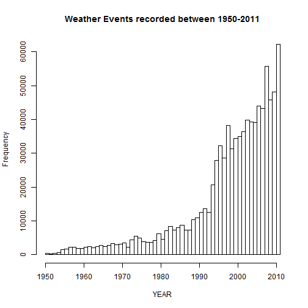
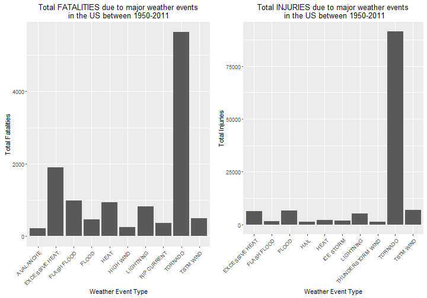
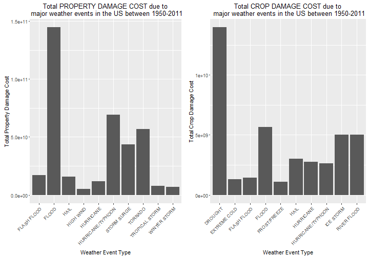

### Analysis of health & economic impact of major weather events in the US (1950-2011).

Synopsis
========
Storms and other severe weather events can cause both public health and economic problems for communities and municipalities. Many severe events can result in fatalities, injuries, and property damage, and preventing such outcomes to the extent possible is a key concern.  This project involves exploring the U.S. National Oceanic and Atmospheric Administration's (NOAA) storm database. This database tracks characteristics of major storms and weather events in the United States, including when and where they occur, as well as estimates of any fatalities, injuries, and property damage.

Data Processing
===============
The data file was downloaded from this link:(https://d396qusza40orc.cloudfront.net/repdata%2Fdata%2FStormData.csv.bz2)
and unzipped into the working directory into repdata-data-StormData.csv


```r
if(!exists("stormData")){
    stormData <- read.csv("repdata-data-StormData.csv",header=TRUE, stringsAsFactors = FALSE)
}
```

Let us look at ```stormData```


```r
str(stormData)
```

```
## 'data.frame':	902297 obs. of  37 variables:
##  $ STATE__   : num  1 1 1 1 1 1 1 1 1 1 ...
##  $ BGN_DATE  : chr  "4/18/1950 0:00:00" "4/18/1950 0:00:00" "2/20/1951 0:00:00" "6/8/1951 0:00:00" ...
##  $ BGN_TIME  : chr  "0130" "0145" "1600" "0900" ...
##  $ TIME_ZONE : chr  "CST" "CST" "CST" "CST" ...
##  $ COUNTY    : num  97 3 57 89 43 77 9 123 125 57 ...
##  $ COUNTYNAME: chr  "MOBILE" "BALDWIN" "FAYETTE" "MADISON" ...
##  $ STATE     : chr  "AL" "AL" "AL" "AL" ...
##  $ EVTYPE    : chr  "TORNADO" "TORNADO" "TORNADO" "TORNADO" ...
##  $ BGN_RANGE : num  0 0 0 0 0 0 0 0 0 0 ...
##  $ BGN_AZI   : chr  "" "" "" "" ...
##  $ BGN_LOCATI: chr  "" "" "" "" ...
##  $ END_DATE  : chr  "" "" "" "" ...
##  $ END_TIME  : chr  "" "" "" "" ...
##  $ COUNTY_END: num  0 0 0 0 0 0 0 0 0 0 ...
##  $ COUNTYENDN: logi  NA NA NA NA NA NA ...
##  $ END_RANGE : num  0 0 0 0 0 0 0 0 0 0 ...
##  $ END_AZI   : chr  "" "" "" "" ...
##  $ END_LOCATI: chr  "" "" "" "" ...
##  $ LENGTH    : num  14 2 0.1 0 0 1.5 1.5 0 3.3 2.3 ...
##  $ WIDTH     : num  100 150 123 100 150 177 33 33 100 100 ...
##  $ F         : int  3 2 2 2 2 2 2 1 3 3 ...
##  $ MAG       : num  0 0 0 0 0 0 0 0 0 0 ...
##  $ FATALITIES: num  0 0 0 0 0 0 0 0 1 0 ...
##  $ INJURIES  : num  15 0 2 2 2 6 1 0 14 0 ...
##  $ PROPDMG   : num  25 2.5 25 2.5 2.5 2.5 2.5 2.5 25 25 ...
##  $ PROPDMGEXP: chr  "K" "K" "K" "K" ...
##  $ CROPDMG   : num  0 0 0 0 0 0 0 0 0 0 ...
##  $ CROPDMGEXP: chr  "" "" "" "" ...
##  $ WFO       : chr  "" "" "" "" ...
##  $ STATEOFFIC: chr  "" "" "" "" ...
##  $ ZONENAMES : chr  "" "" "" "" ...
##  $ LATITUDE  : num  3040 3042 3340 3458 3412 ...
##  $ LONGITUDE : num  8812 8755 8742 8626 8642 ...
##  $ LATITUDE_E: num  3051 0 0 0 0 ...
##  $ LONGITUDE_: num  8806 0 0 0 0 ...
##  $ REMARKS   : chr  "" "" "" "" ...
##  $ REFNUM    : num  1 2 3 4 5 6 7 8 9 10 ...
```

Since this is too much data loaded into the memory, let us keep only the variables we need for the present analysis 
and get rid of the rest


```r
stormData <- stormData[,c("BGN_DATE","EVTYPE","FATALITIES","INJURIES","PROPDMG","PROPDMGEXP","CROPDMG","CROPDMGEXP")]
```


We are only interested in the YEAR part of ```BGN_DATE```. So let us extract that and get rid of ```BGN_DATE```


```r
stormData$YEAR <- as.numeric(format(as.Date(stormData$BGN_DATE, format = "%m/%d/%Y %H:%M:%S"), "%Y"))
stormData$BGN_DATE <- NULL
```


Now we will make a histogram showing the data distribution between 1950- 2011


```r
hist(stormData$YEAR, breaks = 60, xlab = "YEAR", main = "Weather Events recorded between 1950-2011")
```




We notice that the number of events being recorded increased significantly mid-1990s onwards.

#### QUESTION-1 which types of events are most harmful with respect to population health?

We can answer this by totaling all FATALITIES & INUJURIES for each type of weather event between 1950 and 2011 and
check which event type resulted in most FATALITIES & INUJURIES during this period.


**TOP 10 FATALITIES CAUSING WEATHER EVENT TYPES:**


```r
totalFatalities <- aggregate(stormData$FATALITIES, by = list(stormData$EVTYPE), sum)
names(totalFatalities) <- c("Event.Type", "Fatalities")
totalFatalities <- head(totalFatalities[order(totalFatalities$Fatalities, decreasing =TRUE), ], 10)
within(totalFatalities, Event.Type <- factor(x = Event.Type, levels = totalFatalities$Event.Type))
```

```
##         Event.Type Fatalities
## 834        TORNADO       5633
## 130 EXCESSIVE HEAT       1903
## 153    FLASH FLOOD        978
## 275           HEAT        937
## 464      LIGHTNING        816
## 856      TSTM WIND        504
## 170          FLOOD        470
## 585    RIP CURRENT        368
## 359      HIGH WIND        248
## 19       AVALANCHE        224
```

**TOP 10 INJURIES CAUSING WEATHER EVENT TYPES:**

```r
totalInjuries <- aggregate(stormData$INJURIES, by = list(stormData$EVTYPE), "sum")
names(totalInjuries) <- c("Event.Type", "Injuries")
totalInjuries <- head(totalInjuries[order(totalInjuries$Injuries, decreasing =TRUE), ], 10)
within(totalInjuries, Event.Type <- factor(x = Event.Type, levels = totalInjuries$Event.Type))
```

```
##            Event.Type Injuries
## 834           TORNADO    91346
## 856         TSTM WIND     6957
## 170             FLOOD     6789
## 130    EXCESSIVE HEAT     6525
## 464         LIGHTNING     5230
## 275              HEAT     2100
## 427         ICE STORM     1975
## 153       FLASH FLOOD     1777
## 760 THUNDERSTORM WIND     1488
## 244              HAIL     1361
```


#### QUESTION-2 which types of events have the greatest economic consequences?

We can answer this by totaling all property and crop damages for each type of storm event between 1950 and 2011 and
check which event type resulted in most FATALITIES & INUJURIES during this period.
Again, this result can be biased if a certain event type happened to be recorded more than ## another event type 
(esp during the period 1950-1995 when not all event types seem to have been recorded)

First, we will convert the property damage and crop damage data (in both ```PROPDMGEXP``` and ```CROPDMGEXP``` columns) as per
units described in the code book (Storm Events) -> Hundred (H), Thousand (K), Million (M) and Billion (B):

**POPERTY DAMAGE FIELD CONVERSION**

```r
stormData$PROPDMGEXP <- as.character(stormData$PROPDMGEXP)
stormData$PROPDMGEXP[toupper(stormData$PROPDMGEXP) == 'H'] <- "2"
stormData$PROPDMGEXP[toupper(stormData$PROPDMGEXP) == 'K'] <- "3"
stormData$PROPDMGEXP[toupper(stormData$PROPDMGEXP) == 'M'] <- "6"
stormData$PROPDMGEXP[toupper(stormData$PROPDMGEXP) == 'B'] <- "9"
stormData$PROPDMGEXP <- as.numeric(stormData$PROPDMGEXP)
```

```
## Warning: NAs introduced by coercion
```

```r
stormData$PROPDMGEXP[is.na(stormData$PROPDMGEXP)] <- 0
```

A new field ```PROPDAMAGECOST``` contains the result of multiplying ```PROPDMG``` with 10^n^ (where n is got from ```PROPDMGEXP```)

```r
stormData$PROPDAMAGECOST <- stormData$PROPDMG * 10^stormData$PROPDMGEXP
```

**CROP DAMAGE FIELD CONVERSION**

```r
stormData$CROPDMGEXP <- as.character(stormData$CROPDMGEXP)
stormData$CROPDMGEXP[toupper(stormData$CROPDMGEXP) == 'H'] <- "2"
stormData$CROPDMGEXP[toupper(stormData$CROPDMGEXP) == 'K'] <- "3"
stormData$CROPDMGEXP[toupper(stormData$CROPDMGEXP) == 'M'] <- "6"
stormData$CROPDMGEXP[toupper(stormData$CROPDMGEXP) == 'B'] <- "9"
stormData$CROPDMGEXP <- as.numeric(stormData$CROPDMGEXP)
```

```
## Warning: NAs introduced by coercion
```

```r
stormData$CROPDMGEXP[is.na(stormData$CROPDMGEXP)] <- 0
```

A new field ```TOTALPROPDMGCOST``` contains the result of multiplying ```CROPDMG``` with 10^n^ (where n is got from ```CROPDMGEXP```)

```r
stormData$CROPDAMAGECOST <- stormData$CROPDMG * 10^stormData$CROPDMGEXP
```

**TOP 10 WEATHER EVENT TYPES CAUSING PROPERTY DAMAGE:**

```r
totalPropDamage <- aggregate(stormData$PROPDAMAGECOST, by = list(stormData$EVTYPE), sum)
names(totalPropDamage) <- c("Event.Type", "Total.Prop.Damage")
totalPropDamage <- head(totalPropDamage[order(totalPropDamage$Total.Prop.Damage, decreasing =TRUE), ], 10)
within(totalPropDamage, Event.Type <- factor(x = Event.Type, levels = totalPropDamage$Event.Type))
```

```
##            Event.Type Total.Prop.Damage
## 170             FLOOD      144657709807
## 411 HURRICANE/TYPHOON       69305840000
## 834           TORNADO       56947380677
## 670       STORM SURGE       43323536000
## 153       FLASH FLOOD       16822673979
## 244              HAIL       15735267513
## 402         HURRICANE       11868319010
## 848    TROPICAL STORM        7703890550
## 972      WINTER STORM        6688497251
## 359         HIGH WIND        5270046295
```


**TOP 10 WEATHER EVENT TYPES CAUSING CROP DAMAGE:**

```r
totalCropDamage <- aggregate(stormData$CROPDAMAGECOST, by = list(stormData$EVTYPE), sum)
names(totalCropDamage) <- c("Event.Type", "Total.Crop.Damage")
totalCropDamage <- head(totalCropDamage[order(totalCropDamage$Total.Crop.Damage, decreasing =TRUE), ], 10)
within(totalCropDamage, Event.Type <- factor(x = Event.Type, levels = totalCropDamage$Event.Type))
```

```
##            Event.Type Total.Crop.Damage
## 95            DROUGHT       13972566000
## 170             FLOOD        5661968450
## 590       RIVER FLOOD        5029459000
## 427         ICE STORM        5022113500
## 244              HAIL        3025954473
## 402         HURRICANE        2741910000
## 411 HURRICANE/TYPHOON        2607872800
## 153       FLASH FLOOD        1421317100
## 140      EXTREME COLD        1292973000
## 212      FROST/FREEZE        1094086000
```

RESULTS
=======

**Here are the plots that show the storm events that cause the most FATALITIES & INJURIES:** 


```r
library(ggplot2)
library(gridExtra)
fPlot <- ggplot(totalFatalities, aes(x = as.factor(Event.Type),y =Fatalities)) +
    geom_bar(stat="identity") +
    theme(axis.text.x = element_text(angle = 45, hjust = 1)) +
    ylab("Total Fatalities") + xlab("Weather Event Type") +
    ggtitle('Total FATALITIES due to major weather events\nin the US between 1950-2011')

iPlot <- ggplot(totalInjuries, aes(x = as.factor(Event.Type),y =Injuries)) +
    geom_bar(stat="identity") +
    theme(axis.text.x = element_text(angle = 45, hjust = 1)) +
    ylab("Total Injuries") + xlab("Weather Event Type") +
    ggtitle('Total INJURIES due to major weather events\n in the US between 1950-2011')

grid.arrange(fPlot, iPlot, ncol = 2)
```



As we can see, TORNADO is by far the top most cause of Fatalities and Injuries.
However, this result can be biased if a certain weather event type happened to be recorded more than ## another event type (esp during the period 1950-1995 when not all event types seem to have been recorded)

**Here are the plots that show the storm events that cause the most PROPERTY & CROP DAMAGE:** 


```r
library(ggplot2)
library(gridExtra)
pPlot <- ggplot(totalPropDamage, aes(x = as.factor(Event.Type),y =Total.Prop.Damage)) +
    geom_bar(stat="identity") +
    theme(axis.text.x = element_text(angle = 45, hjust = 1)) +
    ylab("Total Property Damage Cost") + xlab("Weather Event Type") +
    ggtitle('Total PROPERTY DAMAGE COST due to\n major weather events in the US between 1950-2011')

cPlot <- ggplot(totalCropDamage, aes(x = as.factor(Event.Type),y =Total.Crop.Damage)) +
    geom_bar(stat="identity") +
    theme(axis.text.x = element_text(angle = 45, hjust = 1)) +
    ylab("Total Crop Damage Cost") + xlab("Weather Event Type") +
    ggtitle('Total CROP DAMAGE COST due to\n major weather events in the US between 1950-2011')

grid.arrange(pPlot, cPlot, ncol = 2)
```



We see that flash floods and thunderstorm winds cause the largest property damages the United States while the most severe weather event for crop damage is the drought.
However, this result can be biased if a certain weather event type happened to be recorded more than another event type (esp during the period 1950-1995 when not all event types seem to have been recorded).
